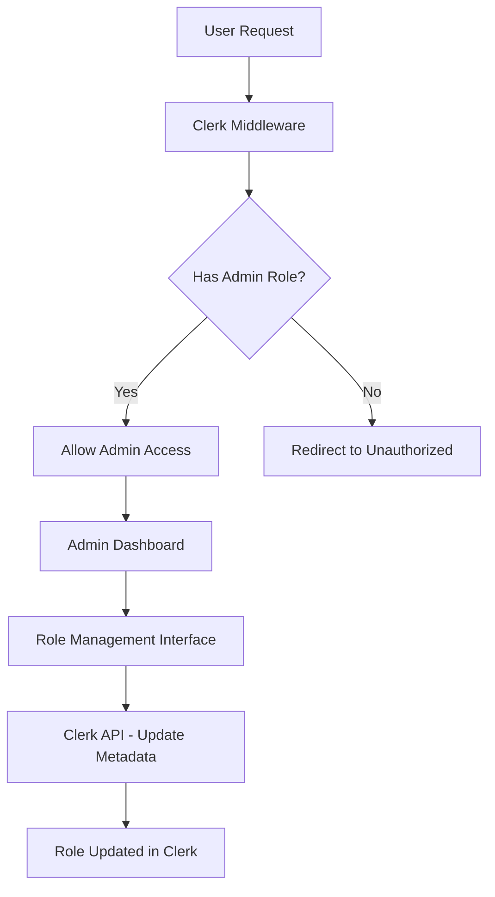
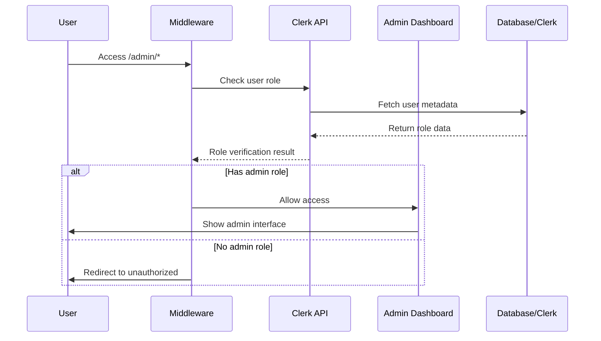

# Design Document

## Overview

This feature implements a comprehensive role-based access control system using Clerk's metadata capabilities. The system will manage three distinct user roles (admin, student, normal user) and enforce access restrictions at both the middleware and component levels. The design leverages Clerk's `publicMetadata` for role storage and implements server-side validation for security.

## Architecture

### Role Management Architecture



### Data Flow



## Components and Interfaces

### 1. Role Management Types

```typescript
// types/admin/roles.ts
export type UserRole = 'admin' | 'student' | 'normal';

export interface UserWithRole extends ClerkUser {
  role: UserRole;
}

export interface RoleUpdateRequest {
  userId: string;
  newRole: UserRole;
}

export interface RoleStats {
  admin: number;
  student: number;
  normal: number;
  total: number;
}
```

### 2. Role Management Service

```typescript
// lib/roleService.ts
export class RoleService {
  static async getUserRole(userId: string): Promise<UserRole>
  static async updateUserRole(userId: string, role: UserRole): Promise<void>
  static async checkAdminAccess(userId: string): Promise<boolean>
  static async getRoleStats(): Promise<RoleStats>
}
```

### 3. Enhanced Middleware

The middleware will be updated to check admin roles specifically:

```typescript
// middleware.ts - Enhanced version
export default clerkMiddleware(async (auth, req) => {
  if (isProtectedRoute(req)) {
    const { userId } = await auth.protect()
    
    if (isAdminRoute(req)) {
      const hasAdminRole = await RoleService.checkAdminAccess(userId)
      if (!hasAdminRole) {
        return NextResponse.redirect(new URL('/unauthorized', req.url))
      }
    }
  }
})
```

### 4. Role Management Components

#### RoleSelector Component
- Dropdown for selecting user roles
- Real-time role updates
- Permission validation

#### RoleFilter Component  
- Filter users by role
- Integration with existing UserFilters

#### RoleStats Component
- Display role distribution
- Real-time statistics

#### UnauthorizedAccess Component
- User-friendly unauthorized access page
- Clear messaging about required permissions

## Data Models

### User Role Storage

Roles will be stored in Clerk's `publicMetadata` for easy access:

```json
{
  "publicMetadata": {
    "role": "admin" | "student" | "normal"
  }
}
```

### Enhanced User Interface

```typescript
interface EnhancedClerkUser extends ClerkUser {
  publicMetadata: {
    role?: UserRole;
  };
}
```

## Error Handling

### Role Validation Errors
- Invalid role assignments
- Permission denied scenarios
- Metadata corruption handling

### Fallback Strategies
- Default to 'normal' role if metadata is missing
- Graceful degradation for role check failures
- Retry mechanisms for Clerk API calls

### Error Response Patterns

```typescript
interface RoleError {
  code: 'INVALID_ROLE' | 'PERMISSION_DENIED' | 'ROLE_UPDATE_FAILED';
  message: string;
  userId?: string;
}
```

## Testing Strategy

### Unit Tests
- Role validation logic
- Permission checking functions
- Component role display logic

### Integration Tests
- Middleware role enforcement
- API endpoint protection
- Role update workflows

### End-to-End Tests
- Complete admin access flow
- Role assignment and verification
- Unauthorized access scenarios

### Test Scenarios

1. **Admin Access Tests**
   - Valid admin can access all admin routes
   - Non-admin users are redirected
   - Role changes take effect immediately

2. **Role Management Tests**
   - Role updates persist correctly
   - Role filters work accurately
   - Statistics update in real-time

3. **Security Tests**
   - Server-side role validation
   - Metadata tampering protection
   - Permission escalation prevention

## Security Considerations

### Role Storage Security
- Use Clerk's secure metadata storage
- Server-side role validation only
- No client-side role assumptions

### Permission Enforcement
- Middleware-level protection
- API endpoint validation
- Component-level access control

### Audit Trail
- Log role changes
- Track admin actions
- Monitor unauthorized access attempts

## Performance Considerations

### Caching Strategy
- Cache role information for active sessions
- Invalidate cache on role updates
- Optimize Clerk API calls

### Database Optimization
- Efficient role-based queries
- Index on role metadata
- Pagination for large user lists

## Migration Strategy

### Existing Users
- Default role assignment for existing users
- Bulk role assignment tools
- Migration verification scripts

### Backward Compatibility
- Graceful handling of users without roles
- Fallback to existing permission logic
- Phased rollout approach