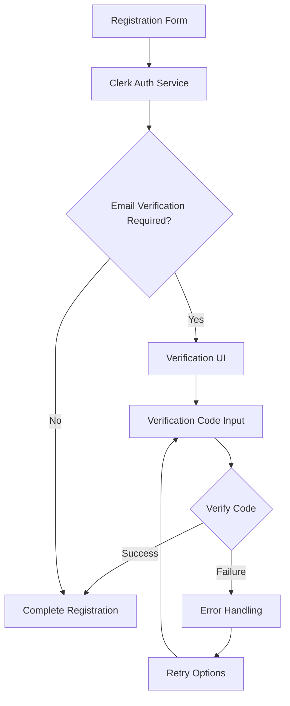
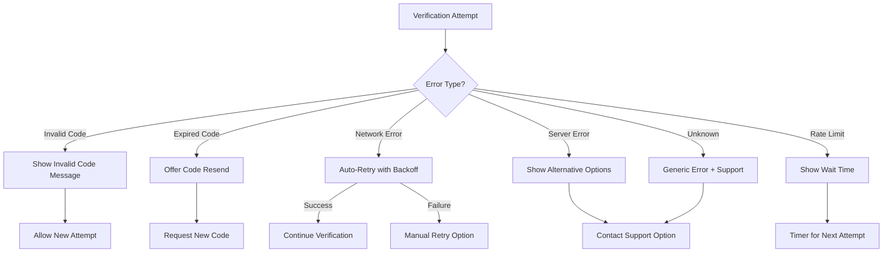

# Design Document: Email Verification Enhancement

## Overview

This design document outlines the approach for enhancing the email verification process during user registration. The current implementation uses Clerk for authentication with a custom UI, but users are experiencing issues with email verification. The solution will focus on improving error handling, user experience, and the overall reliability of the verification flow.

## Architecture

The email verification system is built on top of Clerk's authentication service, with custom React components handling the UI and user interactions. The architecture follows these key principles:

1. **Separation of concerns**: UI components are separated from authentication logic
2. **Progressive enhancement**: The system works with basic functionality first, then enhances with additional features
3. **Resilient error handling**: Multiple layers of error handling to ensure users can recover from issues
4. **State management**: Clear state management to track the verification process

### System Components



## Components and Interfaces

### 1. Registration Component (`register/page.tsx`)

This is the main component that handles the registration process. It needs to be enhanced to:

- Improve error handling during the verification process
- Provide clearer feedback to users
- Handle network issues and retries
- Ensure proper state management between registration and verification steps

### 2. Verification UI

The verification UI is embedded within the registration component and should:

- Clearly indicate the verification step
- Provide an intuitive interface for entering the verification code
- Include options for resending the code and returning to the registration form
- Display appropriate loading states and error messages

### 3. Clerk Integration

The integration with Clerk's authentication service needs to be enhanced to:

- Handle all possible error states from the Clerk API
- Implement proper retry mechanisms
- Ensure consistent state management between the client and Clerk's service

## Data Models

### User Registration State

```typescript
interface RegistrationState {
  email: string;
  firstName: string;
  lastName: string;
  password: string;
  error: string | null;
  loading: boolean;
  showPassword: boolean;
  verifying: boolean;
  code: string;
  verificationAttempts: number;
  lastResendTime: number | null;
}
```

### Error Types

```typescript
enum VerificationErrorType {
  INVALID_CODE = 'invalid_code',
  EXPIRED_CODE = 'expired_code',
  NETWORK_ERROR = 'network_error',
  SERVER_ERROR = 'server_error',
  RATE_LIMIT = 'rate_limit',
  UNKNOWN = 'unknown'
}

interface VerificationError {
  type: VerificationErrorType;
  message: string;
  retryable: boolean;
  suggestedAction?: string;
}
```

## Error Handling

The error handling strategy will be significantly improved with:

1. **Categorized errors**: Different types of errors will be categorized and handled appropriately
2. **Retry mechanisms**: Automatic and manual retry options for recoverable errors
3. **User guidance**: Clear error messages with suggested next steps
4. **Fallback options**: Alternative paths when the primary verification method fails

### Error Handling Flow



## Testing Strategy

The testing strategy will include:

1. **Unit tests**: Testing individual components and functions
2. **Integration tests**: Testing the interaction between components and the Clerk service
3. **Error simulation**: Simulating various error conditions to ensure proper handling
4. **User flow testing**: Testing the complete registration and verification flow
5. **Accessibility testing**: Ensuring the verification UI is accessible

### Test Cases

1. Successful registration and verification
2. Invalid verification code handling
3. Expired verification code handling
4. Network error during verification
5. Server error during verification
6. Rate limiting scenarios
7. Multiple verification attempts
8. Resending verification code
9. Returning to registration form
10. Accessibility compliance

## Implementation Considerations

1. **State Persistence**: Ensure that user data is properly maintained during the verification process
2. **Timeout Handling**: Implement appropriate timeouts for verification attempts
3. **Rate Limiting**: Implement client-side rate limiting for verification attempts and code resends
4. **Progressive Enhancement**: Ensure the basic functionality works without JavaScript
5. **Accessibility**: Ensure the verification UI is accessible to all users
6. **Mobile Responsiveness**: Ensure the verification UI works well on mobile devices
7. **Error Logging**: Implement proper error logging for debugging and monitoring
8. **Analytics**: Add analytics to track verification success rates and common failure points